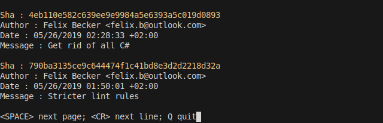
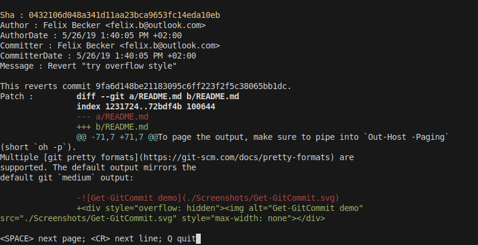
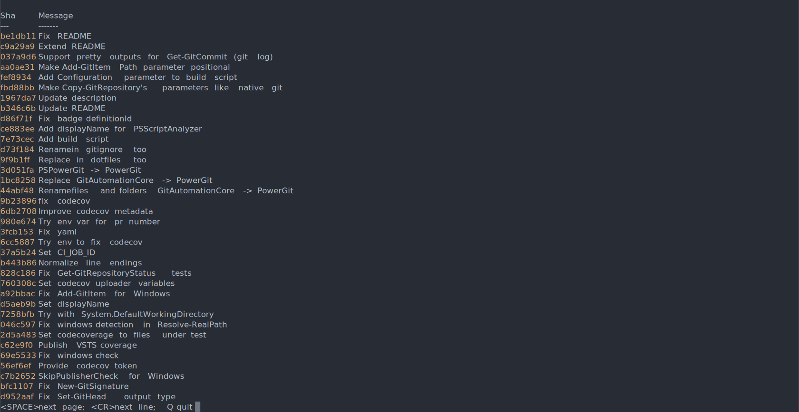
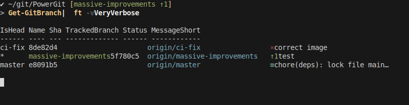
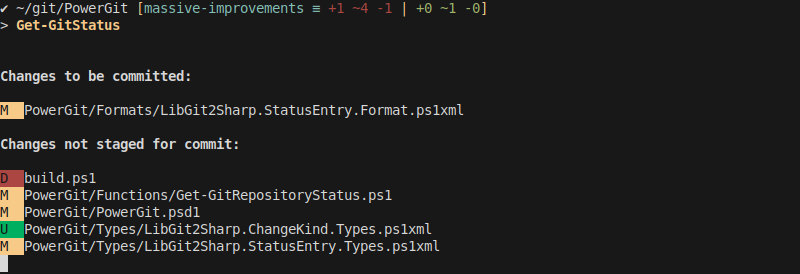

# PowerGit

[](https://www.powershellgallery.com/packages/PowerGit)
[](https://www.powershellgallery.com/packages/PowerGit)
[](https://felixfbecker.visualstudio.com/PowerGit/_build/latest?definitionId=2&branch=master)
[](https://codecov.io/gh/felixfbecker/PowerGit)


`git` with the power of the object pipeline and familiar output formatting. Uses `LibGit2Sharp`, so does not require any
git executable to be installed.

Forked from `GitAutomation` but made to work PSCore (Linux, macOS, Windows) and extended with lots of features.

## Goals

- Utilize the object pipeline for outputs and inputs
- Provide beautiful output formatting that matches native `git` output
- Autocompletion for parameters and properties
- Follow PowerShell naming conventions
- Stay as close as possible to native `git` behaviour
- High test coverage
- Run cross-platform on Windows, macOS and Linux
- Interop with [PSGitHub](https://github.com/pcgeek86/PSGitHub)

## Motivation

git is very object-oriented. The native git client works well for using interactively, but as soon as you want to do
something that doesn't have an explicit command, you have to resort to complex `grep`, `awk` and `xargs` magic.

Take this example to delete local branches that were deleted on the remote from StackOverflow:

```bash
git branch -v|grep \\[gone\\]|awk '{print $1}'|xargs -I{} git branch -D {}
```

With PowerGit, you don't need to go to StackOverflow to remember how to do this:

```powershell
Get-GitBranch | Where-Object { $_.IsTracking -and $_.TrackedBranch.IsGone } | Remove-GitBranch
```

Like this, many complex tasks are trivial with PowerGit that are difficult with git, while the standard use cases all
work the same, but with all the benefits of PowerShell such as autocompletion, flexible formatting.

And because PowerGit is running .NET code directly in PowerShell without external processes, it is even faster than git.

## Caveats

SSH is not currently supported: https://github.com/libgit2/libgit2sharp/issues/1422 You'll have to configure your
remotes with HTTP and pass the `-Credential` parameter for authentication. You can set a credential to always be used
with `$PSDefaultParameterValues` in your `profile.ps1`, or define multiple global variables with credentials for
different servers to pass in the terminal.

For other applications using the native git client, enable the
[git credential helper](https://help.github.com/en/articles/caching-your-github-password-in-git).

## How to use

### Cloning

Use `Copy-GitRepository`. It works just like `git clone`, but with fancier progress reporting:


### Log

Use `Get-GitCommit` to query the commits in the repository.

To page the output, make sure to pipe into `Out-Host -Paging` (short `oh -p`).

Multiple [git pretty formats](https://git-scm.com/docs/pretty-formats) are supported. The default output mirrors the
default git `medium` output:



`short`, `full`, `fuller` and `patch` are supported as alternative list views, e.g.
`Get-GitCommit | Format-List -View Fuller` (or short `fl -v fuller`).

`Patch` will include colored diffs:



For `oneline`, simply pipe to `Format-Table` (short `ft`).



### Branch

Create new branches with `New-GitBranch`, which will directly check out the new branch. The function returns the branch
object of the new branch, which you can directly pipe to `Send-GitBranch`/

```powershell
New-GitBranch my-branch
New-GitBranch my-branch | Send-GitBranch
```

To list all branches, use `Get-GitBranch`. You may supply parameters to filter by name (wildcards supported) or
remote/local/all branches. The default output table view `Verbose` includes information about the tracking status of the
branch. To also see names of tracking branches, pipe to `Format-Table -View VeryVerbose` (or `ft -v veryverbose`), which
mimics `git branch -vv` output.



Delete branches with the `Remove-GitBranch` command (supports pipeline input, `-WhatIf` and `-Confirm`).

The current branch can be retrieved with `Get-GitHead` (which may return a `DetachedHead` object if the HEAD does not
point to a named branch).

To checkout a different branch, use `Set-GitHead`.

### Add

Add a file to the index to prepare it for committing.

```powershell
Add-GitItem path/to/file
Add-GitItem -All
```

### Status

To check the current repository status, use `Get-GitRepositoryStatus` or `Get-GitStatus`. The output is one status entry
for each changed file, grouped by changes to the index and changes to the working directory.



### Commit

Create a commit from the staged changes in the index. If you don't provide the `-Message` parameter, PowerShell will
prompt you for the Message. You can also amend the previous commit (in which case `-Message` is optional), or make an
empty commit with `-AllowEmpty`.

```powershell
Save-GitCommit -Message 'Make changes'
Save-GitCommit -Amend
Save-GitCommit -Message 'No change' -AllowEmpty
```

### Push

Send the currently checked out branch to the remote, or a specific branch by piping a branch or providing `-Name`. You
may provide a remote to push to with `-Remote`. The output is the branch that was sent (including the updated tracking
info), so it can be further piped to different commands.

To push a branch for the first time and set it up to track the upstream, use `-SetUpstream` (or `-u`). The remote will
default to `origin` in that case, and the branch will still default to the current branch.

```powershell
Send-GitBranch # equivalent to Get-GitHead | Send-GitObject
Send-GitBranch -SetUpstream
Send-GitBranch origin master -SetUpstream
New-GitBranch feature/my-feature | Send-GitBranch
Get-GitBranch feature/* | Send-GitBranch
```

### Pull

Incorporate the remote changes into the current branch with `Receive-GitBranch`. To prune deleted branches, pass
`-Prune`. Customize the merge strategy with `-MergeStrategy Merge` or `-MergeStrategy FastForward`.

**Tip**: You can set a default for these parameters with `$PSDefaultParameterValues` in your profile.ps1.

```powershell
Receive-GitBranch
Receive-GitBranch -Prune -MergeStrategy Merge
```

Progress is reported through `Write-Progress`.

### Fetch

To fetch remote branches without merging them into local branches, run `Receive-GitObject`. Fetch tags with
`-TagFetchMode All`.

```powershell
Receive-GitObject
Receive-GitObject -TagFetchMode All
```

### Merge

Merge a revision (commit, branch, etc) into the current branch. You can supply a merge strategy with `-MergeStrategy`.
You may also pipe the revision to be merged.

```powershell
Merge-GitCommit e8091b5
(Get-GitRepository | Get-GitHubRepository).DefaultBranch | Merge-GitCommit
```

### Rebase

You can start a rebase of the current branch onto a different revision with `Start-Rebase`. You may also rebase a
different branch by supplying `-Branch` or piping in branches or even `Get-GitHubPullRequest` output. Progress will be
reported through `Write-Progress`. If there is any conflict encountered, rebasing will pause and you can resume the
process after fixing conflicts with `Resume-GitRebase`. To abort the rebase, run `Stop-GitRebase`.

```powershell
Start-GitRebase master
Get-GitBranch -Name fb/* | Start-GitRebase master
Get-GitHubPullRequest -Filter created | Start-GitRebase master
Resume-GitRebase
Stop-GitRebase
```

### Reset

To hard-reset the current branch to a given revision, use `Reset-GitHead -Hard`. For a soft reset, use `-Soft`. If given
no parameters, `Reset-GitHead` acts as the inverse of `Add-GitItem`.

```powershell
Reset-GitHead
Reset-GitHead -Hard origin/master
```

### Compare

To diff two revisions, run `Compare-GitTree`. The output is a `TreeChanges` object that enumerates all files that were
changed. The function takes two revisions, `-DifferenceRevision` and `-ReferenceRevision`. `-DifferenceRevision`
defaults to the current HEAD. `-ReferenceRevision` must be given, or can be supplied from the pipeline (branches,
commits or pull requests can be piped).

```powershell
Compare-GitTree master
Compare-GitTree -ReferenceRevision master -DifferenceRevision feature/foobar
Get-GitHubPullRequest -Number 1234 | Compare-GitTree -DifferenceRevision master
```

### Config

You can change git configuration with `Set-GitConfiguration`. Use the `-Scope` parameter to define if you want to change
`Local` (default) or `Global` configuration.

```powershell
Set-GitConfiguration -Scope Global -Name 'user.name' -Value 'Felix Becker'
```

## Usage with PSGitHub

### Creating a branch, commiting, and opening a PR for changes

```powershell
# Same repo
New-GitBranch my-branch | Send-GitObject | New-GitHubPullRequest
# From fork with same name to upstream
New-GitBranch my-branch | Send-GitObject | New-GitHubPullRequest -Owner upstream-user -ForkOwner felixfbecker
```

- `Head` is set to the branch name (`refs/heads/...`)
- `Title` is set to `Tip.MessageShort` (the first line of the commit)
- `Base` defaults to default branch of (upstream) repository
- `Owner` defaults to the owner of the current branch (from tracking branch remote URL)
- `ForkOwner` defaults to not set (same repo, no fork)

## Prompt

You can use PowerGit in your `prompt` function to output the current directories' git status like posh-git does. Since
PowerGit doesn't need to call into external processes, it is much faster than posh-git, which is important for a prompt
function to not delay the next prompt.

## Cheat sheet

| `git`                                                    | PowerGit                                                          |
| -------------------------------------------------------- | ----------------------------------------------------------------- |
| `git clone https://github.com/felixfbecker/PowerGit.git` | `Copy-GitRepository https://github.com/felixfbecker/PowerGit.git` |
| `git checkout foo`                                       | `Set-GitHead foo`                                                 |
| `git push`                                               | `Send-GitBranch`                                                  |
| `git push -u origin foo`                                 | `Send-GitBranch -u foo`                                           |
| `git fetch --tags`                                       | `Receive-GitObject -TagFetchMode All`                             |
| `git pull --ff-only`                                     | `Receive-GitBranch -MergeStrategy FastForward`                    |
| `git checkout -b bar`                                    | `New-GitBranch bar`                                               |
| `git status`                                             | `Get-GitRepositoryStatus`                                         |
| `git add README.md`                                      | `Add-GitItem README.md`                                           |
| `git commit -m "message"`                                | `Save-GitCommit -m "message"`                                     |
| `git merge my-branch`                                    | `Merge-GitCommit mybranch`                                        |
| `git reset`                                              | `Reset-GitHead`                                                   |
| `git reset --hard origin/master`                         | `Reset-GitHead -Hard origin/master`                               |
| `git rebase master`                                      | `Start-GitRebase master`                                          |
| `git rebase --continue`                                  | `Resume-GitRebase`                                                |
| `git rebase --abort`                                     | `Stop-GitRebase`                                                  |
| `git log`                                                | `Get-GitCommit`                                                   |
| `git log --oneline`                                      | `Get-GitCommit \| ft`                                             |
| `git log -p`                                             | `Get-GitCommit \| fl -v patch`                                    |
| `git show be1db11`                                       | `Get-GitCommit be1db11 \| fl -v patch`                            |
| `git rev-parse HEAD`                                     | `(Get-GitCommit HEAD).Sha`                                        |

Or dot-source [Aliases.ps1](./PowerGit/Aliases.ps1), which defines aliases for all the native git equivalents.

## Tips

- Run `(Get-Module PowerGit).ExportedCommands` to see a list of all available commands
- All commands have help through `Get-Help`
- PowerShell allows shortening commands if the abbreviation is umambiguous. That means you can write `Copy-GitRepo`
  instead of `Copy-GitRepository`
- Same for parameters: you can write `-m` instead of `-Message`, just like with native git
- Commands and parameters in PowerShell are case-insenstive. If you prefer writing everything lowercase, you can do that
- `$PSDefaultParameterValues` works great for always applying certain options like credentials, prune behaviour, merge
  strategy etc.

## Contributing

### SVG Screenshots

SVG Screenshots are created with [term2svg](https://github.com/nbedos/termtosvg)

```powershell
termtosvg ./Screenshots/frames -s -g 100x12 -t base16_default_dark -c 'pwsh -NoExit -Command clear'
```

`-s` outputs still .svg frames. Always use the `base16_default_dark` theme for consistency. Keep the column width at 100
for best readability in the README (resize your terminal to match the width). If 12 is not enough the row height should
be matched to the output of the command. Execute your command, then execute `exit`. Pick the frame that shows the
command output but does not show the next prompt.
